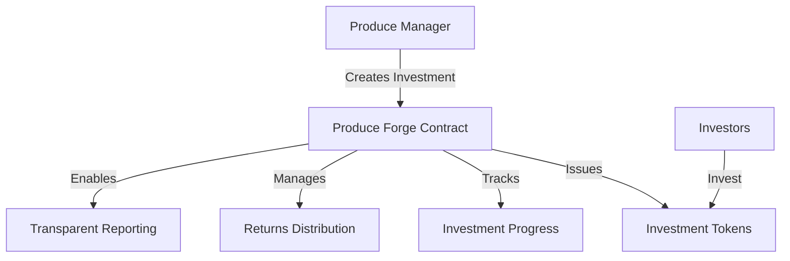

# Compact Produce Forge: Agricultural Investment Platform

A decentralized smart contract platform for fractional agricultural investment on the Stacks blockchain. Compact Produce Forge enables transparent, secure, and accessible investment in agricultural production and trade.

## Overview

Compact Produce Forge transforms agricultural financing by leveraging blockchain technology:

- **Fractional Agricultural Investments**: Enable small and large investors to participate
- **Transparent Investment Tracking**: Immutable records of investments and returns
- **Flexible Investment Opportunities**: Support various crop types and locations
- **Direct Investor-Producer Connection**: Streamlined investment and distribution model
- **Secure, Decentralized Platform**: Built on Stacks blockchain infrastructure

## Architecture

The platform uses a smart contract to manage agricultural investment lifecycles:



### Core Components:
- Investment Opportunity Creation
- Investor Holdings Registry
- Investment Returns Distribution
- Investment Progress Tracking
- Produce Manager Authorization

## Contract Documentation

### Core Functions

#### Investment Management
- `create-produce-investment`: Create new agricultural investment
- `add-produce-manager`: Authorize investment managers
- `invest-in-produce`: Invest in a specific opportunity

#### Investment Operations
- `distribute-returns`: Distribute investment returns
- `claim-returns`: Investors claim their proportional returns
- `get-investment-balance`: Check investment holdings

### Access Control
- Contract Manager: Can add/manage produce managers
- Produce Managers: Create and manage investments
- Investors: Invest and claim returns

## Getting Started

### Prerequisites
- Clarinet
- Stacks Wallet
- STX tokens for investments

### Usage Examples

1. Creating an Investment
```clarity
(contract-call? .produce-forge create-produce-investment
    u1000000    ;; total investment target
    "wheat"     ;; crop type
    "Nebraska"  ;; location
    u10000      ;; maturity blocks
)
```

2. Investing in Produce
```clarity
(contract-call? .produce-forge invest-in-produce
    u1          ;; investment ID
    u5000       ;; investment amount
)
```

3. Claiming Returns
```clarity
(contract-call? .produce-forge claim-returns u1)
```

## Development

### Testing
1. Clone the repository
2. Install Clarinet
3. Run tests:
```bash
clarinet test
```

### Local Development
1. Start Clarinet console:
```bash
clarinet console
```
2. Deploy contract:
```clarity
(contract-call? .produce-forge ...)
```

## Security Considerations

### Key Safety Measures
- Strict access control for managers
- Investment amount validation
- Proportional returns calculation
- Balance checks before transactions

### Limitations
- Returns depend on total investment performance
- Fixed investment and distribution model
- Investments in STX tokens

### Best Practices
- Thoroughly review investment details
- Understand crop and location risks
- Diversify agricultural investments
- Monitor investment progress